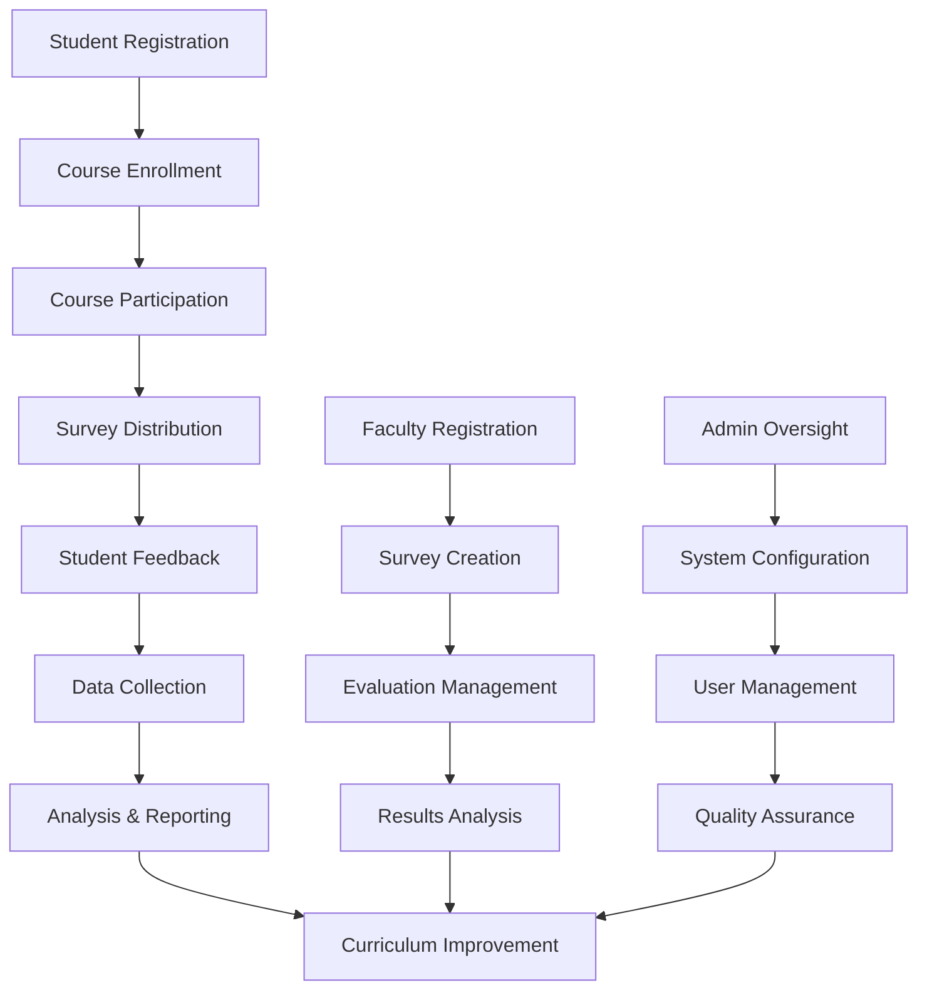
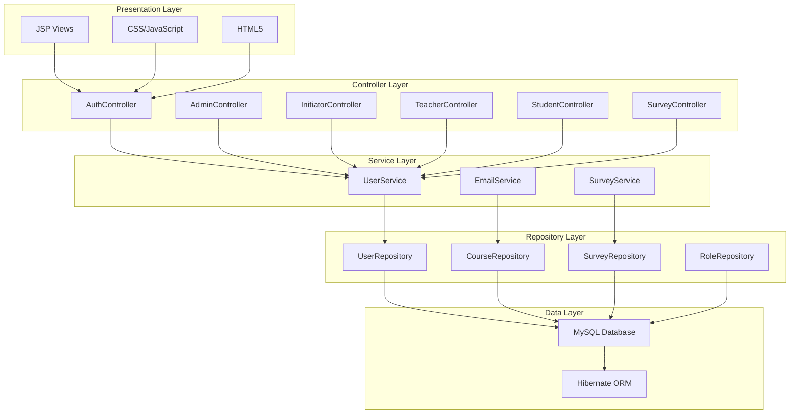
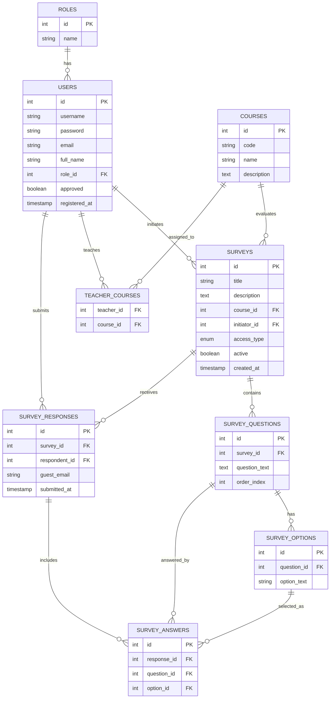
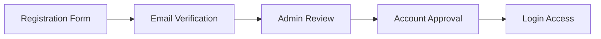

# Rwanda Polytechnic Course Evaluation System

## Table of Contents

1. [Project Overview](#project-overview)
2. [System Scenario](#system-scenario)
3. [User Roles](#user-roles)
4. [System Architecture](#system-architecture)
5. [Database Design](#database-design)
6. [Key Modules](#key-modules)
7. [System Features](#system-features)
8. [Screenshots](#screenshots)
9. [Setup Instructions](#setup-instructions)

---

## Project Overview

The Rwanda Polytechnic Course Evaluation System is a comprehensive web-based platform designed to facilitate the collection and analysis of student feedback on courses and instructors. The system provides a structured approach to course evaluation, enabling students to provide anonymous or authenticated feedback while allowing administrators and faculty members to analyze results for continuous improvement.

### Key Objectives
- **Quality Assurance**: Improve teaching quality through systematic student feedback
- **Data-Driven Decisions**: Provide analytics for curriculum improvement
- **Administrative Efficiency**: Streamline evaluation processes
- **Student Engagement**: Increase participation in course improvement
- **Compliance**: Meet Rwanda Polytechnic quality standards

### Technology Stack
- **Backend**: Spring Boot 3.x with Java 23
- **Frontend**: JSP with JSTL and modern CSS
- **Database**: MySQL with Hibernate ORM
- **Security**: Spring Security with BCrypt password hashing
- **Email**: Gmail SMTP integration
- **Build Tool**: Maven
- **Server**: Embedded Tomcat

---

## System Scenario

### Institutional Context
Rwanda Polytechnic (RP) is committed to providing high-quality technical and vocational education. The evaluation system serves as a critical tool for maintaining educational standards and ensuring continuous improvement across all departments.

### Evaluation Process Flow



### Stakeholder Benefits
- **Students**: Voice in curriculum development, improved learning experience
- **Teachers**: Constructive feedback for professional development
- **Department Heads**: Data-driven decision making for resource allocation
- **Administrators**: Comprehensive oversight and quality metrics
- **Institution**: Accreditation compliance and continuous improvement

---

## User Roles

### 1. Administrator (System Administrator)

**Responsibilities**:
- System configuration and maintenance
- User account management and approval
- Role-based access control
- System monitoring and reporting
- Database backup and recovery

**Access Level**: Full system access

**Key Permissions**:
- Create/Update/Delete all user accounts
- Manage system settings and configurations
- Approve teacher and initiator accounts
- View all evaluations and reports
- System backup and restore operations

---

### 2. Survey Initiator (Department Head)

**Responsibilities**:
- Design and create course evaluations
- Manage evaluation schedules
- Analyze survey participation rates
- Generate departmental reports
- Coordinate with course instructors

**Access Level**: Department-wide evaluation management

**Key Permissions**:
- Create and edit surveys for assigned departments
- View evaluation results and analytics
- Export reports for departmental use
- Manage survey distribution and timing

---

### 3. Teacher (Course Instructor)

**Responsibilities**:
- Course content delivery and management
- Student engagement monitoring
- Participation in evaluation processes
- Review and respond to feedback
- Curriculum development input

**Access Level**: Course-specific management

**Key Permissions**:
- View assigned course evaluations
- Manage course materials and content
- Track student participation
- Access personal performance metrics

---

### 4. Student (Course Participant)

**Responsibilities**:
- Active participation in course evaluations
- Provide constructive feedback
- Engage with course content
- Monitor personal academic progress
- Contribute to quality improvement

**Access Level**: Evaluation participation

**Key Permissions**:
- Access assigned surveys for feedback
- View personal evaluation history
- Participate in anonymous surveys
- Track course completion status

---

## System Architecture

### MVC Architecture Pattern



### Technology Components

#### Frontend Components
- **JSP (JavaServer Pages)**: Dynamic view rendering
- **JSTL (JSP Standard Tag Library)**: Template logic
- **CSS3**: Modern responsive design with glassmorphism
- **JavaScript**: Form validation and AJAX interactions
- **Bootstrap Icons**: Professional UI elements

#### Backend Components
- **Spring Boot**: Application framework and dependency injection
- **Spring MVC**: Web request handling and routing
- **Spring Security**: Authentication and authorization
- **Spring Data JPA**: Database abstraction layer
- **Hibernate**: Object-relational mapping

#### Infrastructure Components
- **MySQL Database**: Primary data storage
- **Tomcat Server**: Web application server
- **Gmail SMTP**: Email notification service
- **Maven**: Build and dependency management

---

## Database Design

### Entity Relationship Diagram



### Database Schema Details

#### Core Tables

**roles**: User role definitions (ADMIN, INITIATOR, TEACHER, STUDENT)

**users**: User accounts with authentication and profile information

**courses**: Academic courses offered across all departments

**teacher_courses**: Many-to-many relationship between teachers and courses

**surveys**: Evaluation instruments with metadata and access controls

**survey_questions**: Individual questions within surveys

**survey_options**: Multiple choice options for questions

**survey_responses**: Individual survey submissions

**survey_answers**: Specific answers given by respondents

### Data Integrity Constraints
- **Primary Keys**: Auto-increment integers for all tables
- **Foreign Keys**: Referential integrity with cascade operations
- **Unique Constraints**: Username and email uniqueness
- **Enum Types**: Standardized access control values
- **Timestamps**: Audit trail for all operations

---

## Key Modules

### 1. Authentication & Authorization Module

**Components**:
- Login/logout functionality
- Session management
- Role-based access control
- Password encryption (BCrypt)
- Remember me functionality

**Security Features**:
- CSRF protection
- SQL injection prevention
- XSS protection
- Secure password storage
- Session timeout management

---

### 2. User Management Module

**Components**:
- User registration with email verification
- Admin approval workflow
- Profile management
- Role assignment
- Account status tracking

**Workflow**:


---

### 3. Course Management Module

**Components**:
- Course creation and editing
- Department classification
- Teacher assignment
- Course enrollment tracking
- Prerequisite management

**Features**:
- Course code generation
- Description management
- Credit hour tracking
- Semester scheduling

---

### 4. Survey Management Module

**Components**:
- Survey creation wizard
- Question bank management
- Response type configuration
- Access control settings
- Scheduling system

**Survey Types**:
- **Anonymous**: Open to all participants
- **Authenticated**: Registered users only
- **Course-specific**: Limited to enrolled students
- **Departmental**: Department-wide evaluations

---

### 5. Analytics & Reporting Module

**Components**:
- Response rate tracking
- Statistical analysis
- Trend identification
- Export functionality
- Visual dashboard

**Metrics**:
- Participation rates
- Average ratings
- Response distributions
- Time-based trends
- Comparative analysis

---

## System Features

### Core Functionality

#### User Experience
- **Responsive Design**: Mobile-friendly interface
- **Real-time Updates**: Instant feedback
- **Progress Tracking**: Visual status indicators
- **Accessibility**: WCAG 2.1 compliance

#### Administrative Features
- **Dashboard Analytics**: Comprehensive overview
- **Bulk Operations**: Batch user management
- **Audit Trail**: Complete activity logging
- **Backup System**: Automated data protection

#### Academic Features
- **Evaluation Templates**: Reusable survey structures
- **Peer Reviews**: Faculty evaluation system
- **Curriculum Mapping**: Course-outcome alignment
- **Quality Metrics**: KPI tracking

### Advanced Features

#### Email Integration
- **SMTP Configuration**: Gmail service integration
- **Template System**: Professional email formatting
- **Notification Rules**: Automated alerts
- **Delivery Tracking**: Email status monitoring

#### Security Features
- **Multi-factor Authentication**: Enhanced login security
- **Session Management**: Secure user sessions
- **Data Encryption**: Sensitive information protection
- **Access Logs**: Complete audit trail

---

## Screenshots

### 1. Login Interface

*Clean, modern login interface with role selection and demo account access*

### 2. Registration Process

*Streamlined registration with email verification and admin approval workflow*

### 3. Administrator Dashboard

*Comprehensive overview with user management, system metrics, and approval workflows*

### 4. User Management

*Complete user lifecycle management with role assignment and approval status*

### 5. Survey Creation

*Intuitive survey builder with question types and response options*

### 6. Analytics Dashboard

*Real-time analytics with visual charts and comprehensive reporting*

### 7. Course Management

*Efficient course organization with teacher assignments and enrollment tracking*

### 8. Student Interface

*Student-focused interface with course evaluations and progress tracking*

---

## Setup Instructions

### Prerequisites

#### Software Requirements
- **Java Development Kit (JDK)**: Version 23 or higher
- **Apache Maven**: Version 3.6 or higher
- **MySQL Server**: Version 8.0 or higher
- **Git**: Version 2.30 or higher

#### Hardware Requirements
- **RAM**: Minimum 4GB, recommended 8GB
- **Storage**: Minimum 10GB free space
- **Processor**: Modern multi-core processor
- **Network**: Internet connection for email services

### Installation Steps

#### 1. Database Setup
```bash
# Install MySQL Server
sudo apt-get install mysql-server

# Create database
mysql -u root -p
CREATE DATABASE course_evaluation_db;

# Import schema
mysql -u root -p course_evaluation_db < database.sql
```

#### 2. Application Configuration
```properties
# application.properties
spring.datasource.url=jdbc:mysql://localhost:3306/course_evaluation_db
spring.datasource.username=root
spring.datasource.password=your_password
spring.mail.host=smtp.gmail.com
spring.mail.username=your_email@gmail.com
spring.mail.password=your_app_password
```

#### 3. Build and Deploy
```bash
# Clone repository
git clone https://github.com/Etienne-2004/GROUP-C_Course-Evaluation-Survey.git

# Build application
mvn clean package

# Run application
java -jar target/assessment-0.0.1-SNAPSHOT.war
```

### Configuration Details

#### Email Service Setup
1. **Enable Gmail App Passwords**
2. **Generate Application Password**
3. **Configure SMTP Settings**
4. **Test Email Delivery**

#### Security Configuration
1. **Generate Strong Secret Keys**
2. **Configure HTTPS Settings**
3. **Set Session Timeouts**
4. **Enable CSRF Protection**

#### Database Optimization
1. **Configure Connection Pool**
2. **Set Query Cache**
3. **Enable Slow Query Log**
4. **Configure Backup Strategy**

### Troubleshooting

#### Common Issues
- **Database Connection**: Check MySQL service and credentials
- **Email Delivery**: Verify SMTP configuration and firewall
- **Performance**: Monitor memory usage and query optimization
- **Authentication**: Clear browser cache and check session settings

#### Support Information
- **Documentation**: Complete API documentation available
- **Logs**: Application logs in `/logs` directory
- **Monitoring**: Real-time system status dashboard
- **Backup**: Automated daily database backups

---

## Conclusion

The Rwanda Polytechnic Course Evaluation System represents a comprehensive solution for educational quality management. By implementing this system, Rwanda Polytechnic can:

- **Enhance Educational Quality**: Through systematic feedback collection and analysis
- **Improve Administrative Efficiency**: Via automated workflows and real-time reporting
- **Support Data-Driven Decisions**: With comprehensive analytics and trend analysis
- **Ensure Compliance**: With institutional and accreditation standards

The system is designed for scalability, maintainability, and continuous improvement, providing a solid foundation for educational excellence at Rwanda Polytechnic.

---

**Project Repository**: https://github.com/Etienne-2004/GROUP-C_Course-Evaluation-Survey.git

**Technical Support**: For technical assistance and system maintenance, contact the development team through the project repository.

**Version**: 1.0.0 (Production Ready)

**Last Updated**: March 2026
